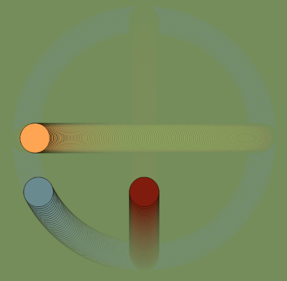
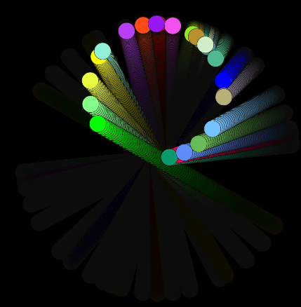

# circle_illusion
coding trig functions and polar coordinates to create a circle_illusion

## sinCosCircle

A quick #P5js sketch partially inspired by a numberphile video on trig functions. Also partially inspired by a dog we know. Let's call him Chewko. He runs in circles and Mj and I run back and forth. This could be an abstract visualization of our play. Chewko is the blue circle of course. And our motions are all defined by sin, cos, or both. I am again naming objects after loved ones.
 
 updateY(x) {
    this.y = map(sin(x), 0, 1, height/2, height/10); // from the middle to the edges
   
  }
  updateX(y) {
    this.x = map(cos(y), 0, 1, width/2, width/10);
  }
  
  An X motion is obtained by mapping to the cos(y) where y is an iteration from 0 to 360 : but plotting y as constant
  
  A Y motion is obtaied by mapping to the  sin (x) where x is an interation from 0 to 360 : but plotting x as constant
  the circle motion is obtaaind mapping and ploting both x and y
  
  see code for more comments
  
 [see it run on p5 editor](https://editor.p5js.org/greggelong/present/_HLtlcvEw)

 [see it run on gitHub](https://greggelong.github.io/circle_illusion/sinCircleIllusion)

  
## sinCircleIllusion

 
 Another #P5js sketch inspired by dogs we know, and trig functions.  
 
 The sketch starts with an array of ball objects named after loved ones. they are actually moving in straight lines up and down mapping the y coordinate to the sine of the x coordinate, but because canvas is rotated to get the other angles.  And focusing on the group you get the impression of circular motion. When the mouse is clicked or the screen is tapped more balls are added. 
 
 see code for more comments
 
[see it run on p5 editor](https://editor.p5js.org/greggelong/present/YwUKDeeok)

[see it run on gitHub](https://greggelong.github.io/circle_illusion//sinCosCircle)

[Home](https://greggelong.github.io/)
